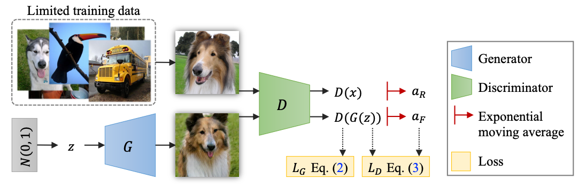

# Regularizing Generative Adversarial Networks under Limited Data
[[Project Page]](https://hytseng0509.github.io/lecam-gan)[[Paper]]()

Implementation for our GAN regularization method. The proposed regularization 1)
improves the performance of GANs under limited training data, and 2) complements
the exisiting data augmentation approches.

*Please note that this is not an officially supported Google product.*

## Paper
Please cite our paper if you find the code or dataset useful for your research.

Regularizing Generative Adversarial Networks under Limited Data<br>
[Hung-Yu Tseng](https://hytseng0509.github.io/), [Lu Jiang](http://www.lujiang.info/), [Ce Liu](http://people.csail.mit.edu/celiu/), [Ming-Hsuan Yang](http://faculty.ucmerced.edu/mhyang/), [Weilong Yang](https://www.linkedin.com/in/weilongyang/)<br>
Computer Vision and Pattern Recognition (CVPR), 2021
```
@inproceedings{lecamgan,
  author = {Tseng, Hung-Yu and Jiang, Lu and Liu, Ce and Yang, Ming-Hsuan and Yang, Weilong},
  title = {Regularing Generative Adversarial Networks under Limited Data},
  booktitle = {CVPR},
  year = {2021}
}
```

<div align="center">
  
</div>

## Installation and Usage

We provide three implementations: [biggan_cifar](biggan_cifar), [biggan_imagenet](biggan_imagenet), and [stylegan2](stylegan2). Plesase refer to the `README.md` file under each sub-folder for the installation and usage guides.
